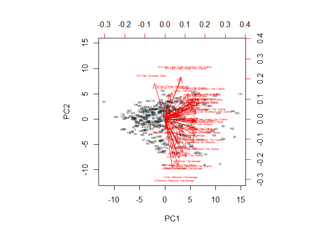
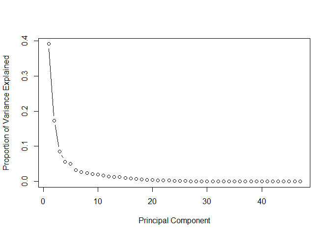
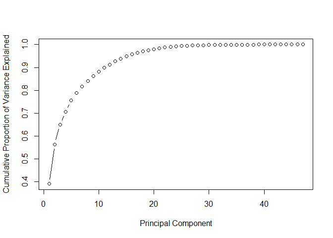
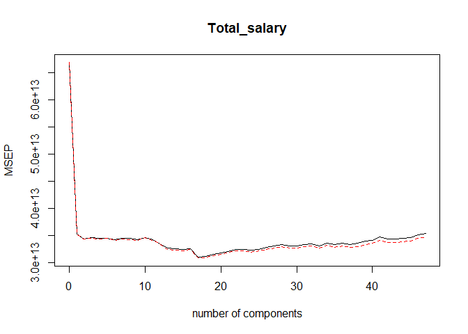
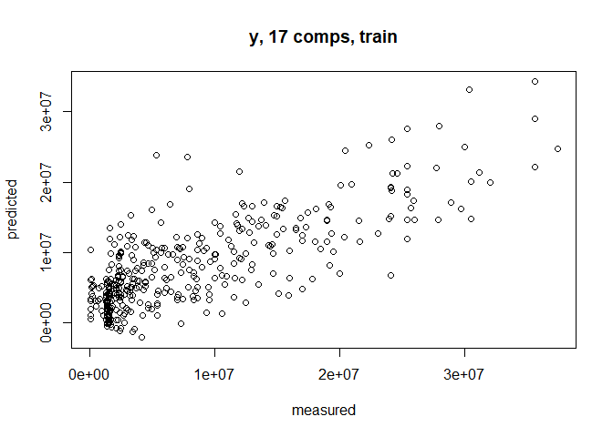

NBA player salary prediction
================

``` r
nba = read.csv("nba_data_raw.csv")
nba = na.omit(nba)
nba = subset(nba, select=-c(Player))
```

### Linear Regression Model(train:test = 0.8:0.2)

#### Forward

``` r
library(leaps)
set.seed(1)

train=sample(c(TRUE, FALSE), nrow(nba), replace=TRUE, prob=c(0.8,0.2))
test=(!train)
regfit.best = regsubsets(Total_salary~., data=nba[train,], nvmax=47,method='forward')
test.mat = model.matrix(Total_salary~., data=nba[test,])
val.errors=rep(NA,47)
for (i in 1:47){
  coefi=coef(regfit.best, id=i)
  pred=test.mat[,names(coefi)]%*%coefi
  val.errors[i]=sqrt(mean((nba$Total_salary[test]-pred)^2))
}
print(paste("Test Dataset Minimum RMSE:", round(min(val.errors),2)))
```

    ## [1] "Test Dataset Minimum RMSE: 5168947.77"

``` r
coef(regfit.best ,which.min(val.errors))
```

    ##                   (Intercept)                           Age 
    ##                   -6693742.42                     363100.05 
    ##                         Games                 Games_Started 
    ##                     -45965.06                      68436.93 
    ##               Points_Per_Game Value_over_Replacement_Player 
    ##                     538669.44                    1253328.74

#### Backward

``` r
library(leaps)
set.seed(1)
train=sample(c(TRUE, FALSE), nrow(nba), replace=TRUE, prob=c(0.8,0.2))
test=(!train)
regfit.best = regsubsets(Total_salary~., data=nba[train,], nvmax=47,method='backward')
test.mat = model.matrix(Total_salary~., data=nba[test,])
val.errors=rep(NA,47)
for (i in 1:47){
  coefi=coef(regfit.best, id=i)
  pred=test.mat[,names(coefi)]%*%coefi
  val.errors[i]=sqrt(mean((nba$Total_salary[test]-pred)^2))
}
print(paste("Test Dataset Minimum RMSE:", round(min(val.errors),2)))
```

    ## [1] "Test Dataset Minimum RMSE: 5140189.55"

``` r
coef(regfit.best ,which.min(val.errors))
```

    ##                   (Intercept)                           Age 
    ##                   -7032117.01                     386145.46 
    ##                         Games                 Games_Started 
    ##                     -47168.94                      69042.63 
    ##  Field_Goal_Attempts_Per_Game  Free_Throw_Attempts_Per_Game 
    ##                     624477.22                    1045621.28 
    ##            Turnovers_Per_Game Value_over_Replacement_Player 
    ##                   -1630096.10                    1369224.14

#### Linear Regression Model(all data)

``` r
regfit.fw = lm(Total_salary~Age+Games+Games_Started+Points_Per_Game+Value_over_Replacement_Player, data=nba)
summary(regfit.fw)
```

    ## 
    ## Call:
    ## lm(formula = Total_salary ~ Age + Games + Games_Started + Points_Per_Game + 
    ##     Value_over_Replacement_Player, data = nba)
    ## 
    ## Residuals:
    ##       Min        1Q    Median        3Q       Max 
    ## -16739234  -3421754   -632421   2733543  16884986 
    ## 
    ## Coefficients:
    ##                               Estimate Std. Error t value Pr(>|t|)    
    ## (Intercept)                   -7552819    1822363  -4.145 4.21e-05 ***
    ## Age                             406220      67446   6.023 4.08e-09 ***
    ## Games                           -49190      11191  -4.395 1.44e-05 ***
    ## Games_Started                    64697      13017   4.970 1.02e-06 ***
    ## Points_Per_Game                 519177      71326   7.279 1.98e-12 ***
    ## Value_over_Replacement_Player  1464703     270191   5.421 1.06e-07 ***
    ## ---
    ## Signif. codes:  0 '***' 0.001 '**' 0.01 '*' 0.05 '.' 0.1 ' ' 1
    ## 
    ## Residual standard error: 5373000 on 376 degrees of freedom
    ## Multiple R-squared:  0.5775, Adjusted R-squared:  0.5719 
    ## F-statistic: 102.8 on 5 and 376 DF,  p-value: < 2.2e-16

#### Linear Regression VIF

``` r
library(car)
```

    ## Loading required package: carData

``` r
vif(regfit.fw)
```

    ##                           Age                         Games 
    ##                      1.038538                      1.334755 
    ##                 Games_Started               Points_Per_Game 
    ##                      2.227391                      2.337412 
    ## Value_over_Replacement_Player 
    ##                      1.822132

### PCA

``` r
nba.pca <- prcomp(nba[,-c(48)], center = TRUE, scale. = TRUE)
summary(nba.pca)
```

    ## Importance of components:
    ##                           PC1    PC2    PC3     PC4     PC5     PC6
    ## Standard deviation     4.2844 2.8519 2.0070 1.62744 1.53549 1.24136
    ## Proportion of Variance 0.3906 0.1731 0.0857 0.05635 0.05016 0.03279
    ## Cumulative Proportion  0.3906 0.5636 0.6493 0.70565 0.75582 0.78860
    ##                            PC7     PC8     PC9    PC10    PC11    PC12
    ## Standard deviation     1.12554 1.06925 1.01029 0.97464 0.89221 0.81422
    ## Proportion of Variance 0.02695 0.02433 0.02172 0.02021 0.01694 0.01411
    ## Cumulative Proportion  0.81556 0.83988 0.86160 0.88181 0.89875 0.91285
    ##                          PC13   PC14    PC15    PC16    PC17    PC18
    ## Standard deviation     0.7994 0.7665 0.67590 0.62230 0.59260 0.54107
    ## Proportion of Variance 0.0136 0.0125 0.00972 0.00824 0.00747 0.00623
    ## Cumulative Proportion  0.9264 0.9389 0.94867 0.95691 0.96438 0.97061
    ##                           PC19    PC20    PC21    PC22    PC23    PC24
    ## Standard deviation     0.48531 0.44815 0.42507 0.39115 0.35695 0.31280
    ## Proportion of Variance 0.00501 0.00427 0.00384 0.00326 0.00271 0.00208
    ## Cumulative Proportion  0.97562 0.97989 0.98374 0.98699 0.98970 0.99179
    ##                           PC25    PC26    PC27   PC28    PC29    PC30
    ## Standard deviation     0.29566 0.25439 0.22396 0.1936 0.17835 0.15966
    ## Proportion of Variance 0.00186 0.00138 0.00107 0.0008 0.00068 0.00054
    ## Cumulative Proportion  0.99365 0.99502 0.99609 0.9969 0.99756 0.99811
    ##                           PC31    PC32    PC33    PC34    PC35    PC36
    ## Standard deviation     0.13989 0.12805 0.12022 0.10740 0.09275 0.07617
    ## Proportion of Variance 0.00042 0.00035 0.00031 0.00025 0.00018 0.00012
    ## Cumulative Proportion  0.99852 0.99887 0.99918 0.99942 0.99961 0.99973
    ##                           PC37    PC38    PC39    PC40    PC41    PC42
    ## Standard deviation     0.06656 0.05522 0.05462 0.03204 0.01805 0.01573
    ## Proportion of Variance 0.00009 0.00006 0.00006 0.00002 0.00001 0.00001
    ## Cumulative Proportion  0.99982 0.99989 0.99995 0.99997 0.99998 0.99999
    ##                           PC43    PC44     PC45     PC46     PC47
    ## Standard deviation     0.01495 0.01303 0.009961 0.008831 0.007361
    ## Proportion of Variance 0.00000 0.00000 0.000000 0.000000 0.000000
    ## Cumulative Proportion  0.99999 1.00000 1.000000 1.000000 1.000000

``` r
biplot(nba.pca,scale=0,cex=0.4)
```

<!-- -->

``` r
pr_var = nba.pca$sdev^2
prop_varex <- pr_var/sum(pr_var)

# scree plot
plot(prop_varex, xlab = "Principal Component",
             ylab = "Proportion of Variance Explained",
             type = "b")
```

<!-- -->

``` r
# cumulative scree plot
plot(cumsum(prop_varex), xlab = "Principal Component",
              ylab = "Cumulative Proportion of Variance Explained",
              type = "b")
```

<!-- -->

### PCR

``` r
library(pls)
```

    ## 
    ## Attaching package: 'pls'

    ## The following object is masked from 'package:stats':
    ## 
    ##     loadings

``` r
x = model.matrix(Total_salary~.,data=nba)[,-1]
y = nba$Total_salary
pcr.fit=pcr(Total_salary~., data=nba, subset=train, scale=TRUE, validation='CV')
summary(pcr.fit)
```

    ## Data:    X dimension: 314 47 
    ##  Y dimension: 314 1
    ## Fit method: svdpc
    ## Number of components considered: 47
    ## 
    ## VALIDATION: RMSEP
    ## Cross-validated using 10 random segments.
    ##        (Intercept)  1 comps  2 comps  3 comps  4 comps  5 comps  6 comps
    ## CV         8174555  5936834  5866523  5883157  5871704  5875105  5853624
    ## adjCV      8174555  5934492  5864083  5879273  5867685  5869702  5846073
    ##        7 comps  8 comps  9 comps  10 comps  11 comps  12 comps  13 comps
    ## CV     5872317  5878015  5853161   5888224   5851046   5784128   5715243
    ## adjCV  5864890  5856528  5843430   5880442   5843150   5787883   5698003
    ##        14 comps  15 comps  16 comps  17 comps  18 comps  19 comps
    ## CV      5703903   5694439   5703030   5576159   5582735   5614482
    ## adjCV   5687910   5676979   5701397   5557064   5563553   5593188
    ##        20 comps  21 comps  22 comps  23 comps  24 comps  25 comps
    ## CV      5638150   5660571   5696703   5703021   5684907   5698351
    ## adjCV   5615297   5637118   5671594   5677371   5649921   5670358
    ##        26 comps  27 comps  28 comps  29 comps  30 comps  31 comps
    ## CV      5730876   5751786   5775132   5757662   5752250   5778371
    ## adjCV   5700294   5719893   5743960   5722618   5717044   5742495
    ##        32 comps  33 comps  34 comps  35 comps  36 comps  37 comps
    ## CV      5790141   5757996   5801515   5771629   5797970   5774073
    ## adjCV   5748837   5723117   5762709   5728588   5755115   5727285
    ##        38 comps  39 comps  40 comps  41 comps  42 comps  43 comps
    ## CV      5792326   5826267   5844857   5892019   5862823   5867713
    ## adjCV   5746174   5776116   5793119   5838363   5808666   5813524
    ##        44 comps  45 comps  46 comps  47 comps
    ## CV      5873432   5885291   5927719   5950170
    ## adjCV   5818481   5829749   5869524   5890912
    ## 
    ## TRAINING: % variance explained
    ##               1 comps  2 comps  3 comps  4 comps  5 comps  6 comps
    ## X               39.17    56.00    65.02    70.81    75.67    78.95
    ## Total_salary    47.50    48.96    49.22    49.71    49.87    50.47
    ##               7 comps  8 comps  9 comps  10 comps  11 comps  12 comps
    ## X               81.75    84.04    86.28     88.18     89.81     91.28
    ## Total_salary    50.56    51.45    51.57     51.57     52.62     53.15
    ##               13 comps  14 comps  15 comps  16 comps  17 comps  18 comps
    ## X                92.69     93.98     94.97     95.75     96.47     97.08
    ## Total_salary     55.48     56.23     56.68     56.94     58.90     58.95
    ##               19 comps  20 comps  21 comps  22 comps  23 comps  24 comps
    ## X                97.55     98.00     98.41     98.73     98.99     99.19
    ## Total_salary     59.01     59.07     59.08     59.09     59.14     59.65
    ##               25 comps  26 comps  27 comps  28 comps  29 comps  30 comps
    ## X                99.39     99.53     99.63     99.71     99.77     99.82
    ## Total_salary     59.76     59.94     59.97     60.01     60.80     60.90
    ##               31 comps  32 comps  33 comps  34 comps  35 comps  36 comps
    ## X                99.86     99.89     99.92     99.94     99.96     99.97
    ## Total_salary     60.91     61.22     61.49     61.80     62.70     62.76
    ##               37 comps  38 comps  39 comps  40 comps  41 comps  42 comps
    ## X                99.98     99.99    100.00    100.00    100.00    100.00
    ## Total_salary     63.37     63.41     63.58     63.66     63.66     63.97
    ##               43 comps  44 comps  45 comps  46 comps  47 comps
    ## X               100.00    100.00    100.00    100.00    100.00
    ## Total_salary     64.04     64.13     64.13     64.19     64.19

``` r
validationplot(pcr.fit, val.type="MSEP")
```

<!-- -->

``` r
pcr.pred=predict(pcr.fit, x[test,], ncomp=17)
print(paste("Test Dataset Minimum RMSE:", round(sqrt(mean((pcr.pred-y[test])^2)),2)))
```

    ## [1] "Test Dataset Minimum RMSE: 5376882.86"

#### PCR(all data)

``` r
pcr.fit=pcr(y~x, scale=TRUE, ncomp=17)
summary(pcr.fit)
```

    ## Data:    X dimension: 382 47 
    ##  Y dimension: 382 1
    ## Fit method: svdpc
    ## Number of components considered: 17
    ## TRAINING: % variance explained
    ##    1 comps  2 comps  3 comps  4 comps  5 comps  6 comps  7 comps  8 comps
    ## X    39.05    56.36    64.93    70.57    75.58    78.86    81.56    83.99
    ## y    46.42    48.55    48.72    48.95    48.98    50.56    50.79    52.01
    ##    9 comps  10 comps  11 comps  12 comps  13 comps  14 comps  15 comps
    ## X    86.16     88.18     89.87     91.29     92.64     93.89     94.87
    ## y    52.09     52.30     53.07     53.67     55.63     57.17     57.69
    ##    16 comps  17 comps
    ## X     95.69     96.44
    ## y     58.01     59.24

``` r
predplot(pcr.fit)
```

<!-- -->
